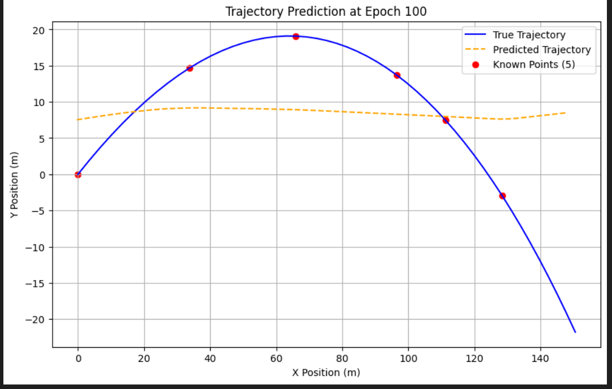
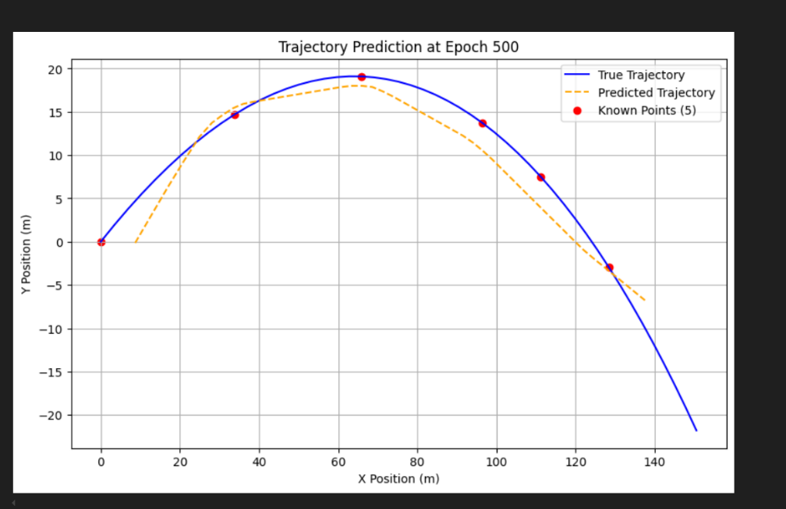

# NN Predicting a Generated Shuttlecock Trajectory

This repository contains code for predicting shuttlecock trajectories using a neural network. The project includes data generation, visualization, and training of a neural network model to predict the trajectory of a shuttlecock.

## Repository Structure

- `frames_NN/`: Directory containing frames generated during training.
- `Presentaion test technique.pptx`: Presentation file for the technical test.
- `PysicsbasedNN.ipynb`: Jupyter notebook containing the code for data generation, visualization, and neural network training.
- `Test - Stage n°2.docx`: Document related to the second stage of the test.
- `shuttlecock’s trajectory in badminton .pdf`: A Study of Shuttlecock’s Trajectory in Badminton - PMC Paper.

## Requirements

- Python 3.x
- Jupyter Notebook
- NumPy
- Matplotlib
- PyTorch
- Imageio

## Installation

1. Clone the repository:
    ```sh
    git clone https://github.com/GhaouiYoussef/Trajectory-Learning-and-Optimized-Tracking-in-Simulated-2D-Space
    cd Trajectory-Learning-and-Optimized-Tracking-in-Simulated-2D-Space
    ```

2. Install the required packages:
    ```sh
    pip install numpy matplotlib torch imageio
    ```

## Usage

1. Open the Jupyter notebook:
    ```sh
    jupyter notebook PysicsbasedNN.ipynb
    ```

2. Run the cells in the notebook to generate data, visualize trajectories, and train the neural network model.

## Code Overview

### Data Generation

The `GenDataEquations` class is used to generate shuttlecock trajectory data based on initial velocity and launch angle.

### Visualization

The trajectories are visualized using Matplotlib. The code plots the trajectories and combines the data for training.

Here's the updated section for your README.md with the loss explanation added under the Neural Network Model:

---

### Neural Network Model

The `PiNN` class defines the neural network model using PyTorch. The model is trained to predict the shuttlecock trajectory.

### Loss Functions

The training process incorporates two types of loss functions to ensure accurate predictions while adhering to physical principles:

#### 1. Data-Based Loss
The data-based loss ensures the model accurately predicts the known trajectory points:
```math
L_{\text{data}} = \text{mean} \left( (x_{\text{pred}} - x_{\text{true}})^2 + (y_{\text{pred}} - y_{\text{true}})^2 \right)
```
This loss is calculated only for the known data points, ensuring that the predicted curve matches the provided ground truth values at these points.

#### 2. Physics-Based Loss
The physics-based loss enforces physical constraints derived from the motion of the shuttlecock:
- **Vertical Motion Loss:**
```math
L_{\text{vertical}} = \text{mean} \left( \left( m v_y^2 + b v_y^2 - m g \right)^2 \right)
```
This term ensures that the vertical motion obeys Newton's second law, accounting for gravitational force, drag, and acceleration.

- **Horizontal Motion Loss:**
```math
L_{\text{horizontal}} = \text{mean} \left( \left( m v_x^2 + b v_x^2 \right)^2 \right)
```
This term enforces consistency with horizontal dynamics dominated by drag.

#### Combined Loss
The total loss combines the data-based loss and the physics-based loss:
```math
L_{\text{total}} = \lambda_{\text{data}} L_{\text{data}} + \lambda_{\text{physics}} L_{\text{physics}}
```
Here, 
```math
\lambda_{\text{data}} and \lambda_{\text{physics}}
```
are scaling factors to balance the two components.

The inclusion of physics-based loss ensures that the model's predictions are physically plausible, even in regions where training data is sparse or unavailable, while the data-based loss anchors the predictions to known points.

### Training

The `train_model` and `train_model_with_video` functions are used to train the model. The training process includes saving frames and generating a video of the training progress.

## Results

The progress from the 100th epoch to the 500th epoch during the incorporation of pysics loss + data based loss can be found in the notebooks outputs:
|  |  |
|---------------------------------------------------------------------------------------------------|---------------------------------------------------------------------------------------------------|
| Epoch 100                                                                             | Epoch 500                                                                              |


## License

This project is licensed under the MIT License.
